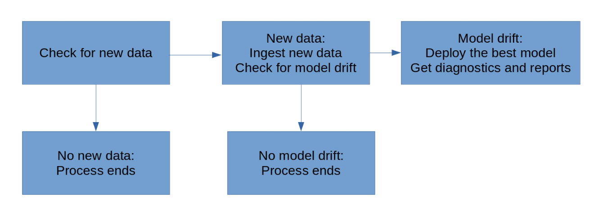

# Project 4 - Dyanmic Risk Assessment

## Overview
This repository includes a full pipeline that dooes several steps that mimic a real-life deployment of a Machine Learning model. The following image illustrates those steps:



## Steps
To run the full process please run the following code:
```bash
python scripts/fullprocess.py
```
Next you can find code and explanation of each of the steps:

1. Ingestion: This program will check if there is new data available for training as long as it has a .csv format. It will merge all data and save it in a folder
```bash
python scripts/ingestion.py
```
2. Training, scoring & deployment: This will train an ML Logistic Regression Model that will predict if an employee will exit the company or not as well as scoring the model with test data and have everything setup for production (deployment)

```bash
python scripts/training.py
python scripts/scoring.py
python scripts/deployment.py
```

3. Diagnostics: This script will produce several statistical and operational indicators for spot checking the underlying data and package updates.

```bash
python scripts/diagnostics.py
```

4. Reporting: This will create a simple confusion matrix for diagnostics
```bash
python scripts/reporting.py
```

5. Flask App Deployment: if you want to run the app and perform some api calls you can use these scripts:
```bash
python scripts/app.py && scripts/apicalls.py
```

Finally there is a file that will let you perform a cron job every 10 minutes (conjob.txt)